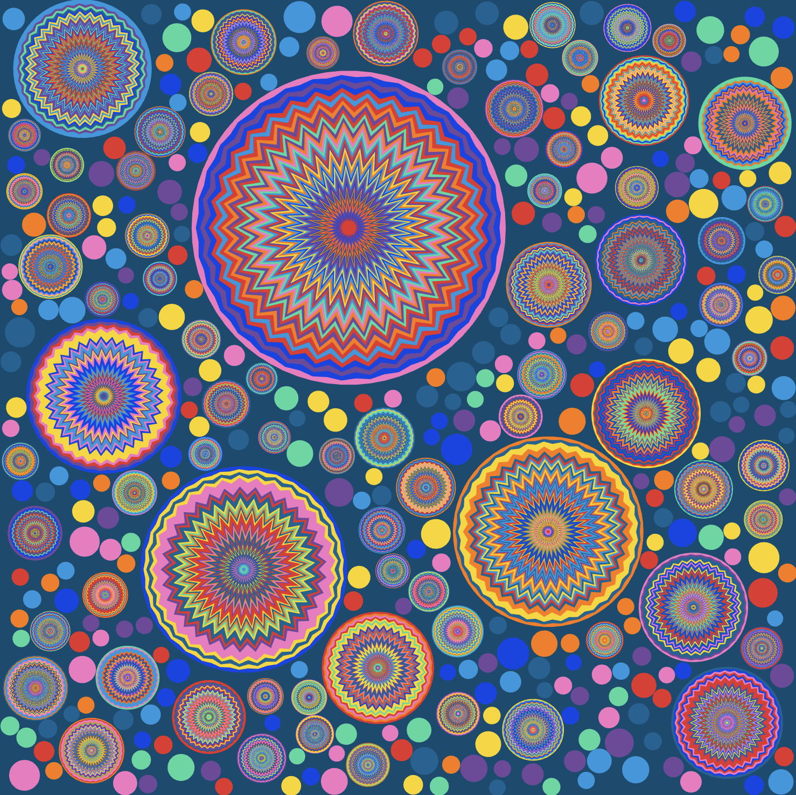
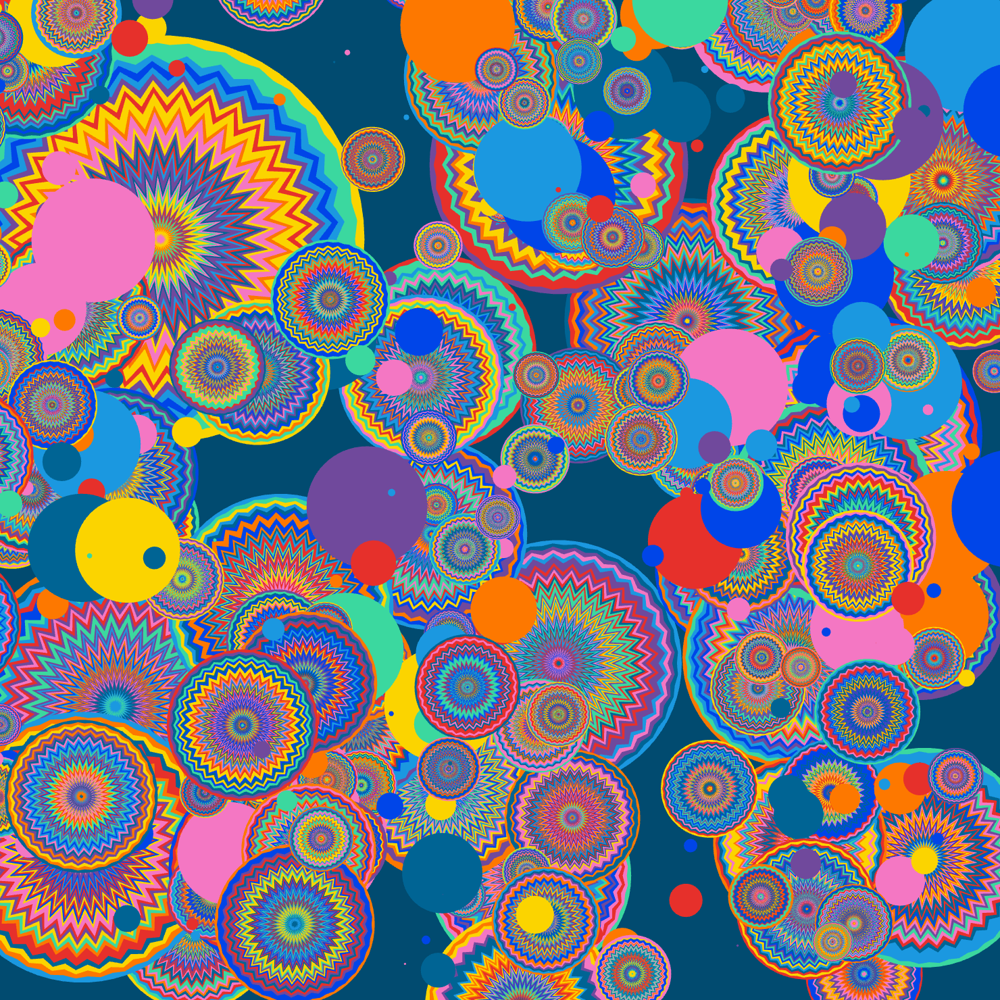
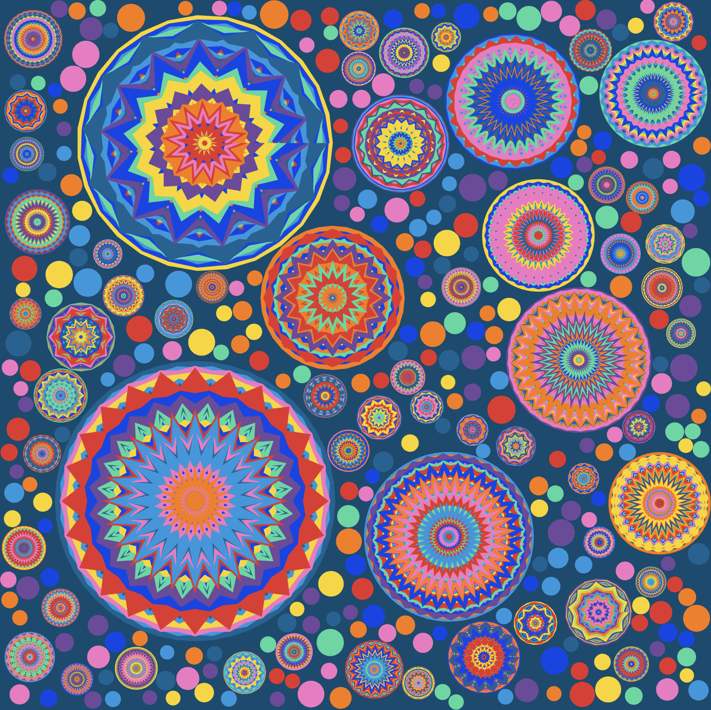

# Cheryl_creative-coding-major-project

## Part 1 Group Task
Chosen Art work - Wheels of fortune by Pacita Abad

 

**Group Representation of the "Wheels of furtune"**

## Part 2 Individual Task
**First commit**

To add Perlin noise animation to the CirclePacking class, I've incorporate the noise function to animate the positions or sizes of the circles over time. 

1. Add a time variable to the CirclePacking class to control the noise function.
2. Modify the **‘generatePoints’** method to store initial positions and sizes.
3. Create a new method **‘updatePoints’** to update positions and sizes using Perlin noise.
4. Call the **‘updatePoints’** method within the **‘draw’** method to animate the circles.

**Second commit**

Modified to keep the circles still but animating the waves within the circles and adding randomness to the size, scale and numbers of star vertices.

1. **'updatePoints()'** is added to update the positions and sizes of the points using Perlin noise, creating a smooth animation effect:

